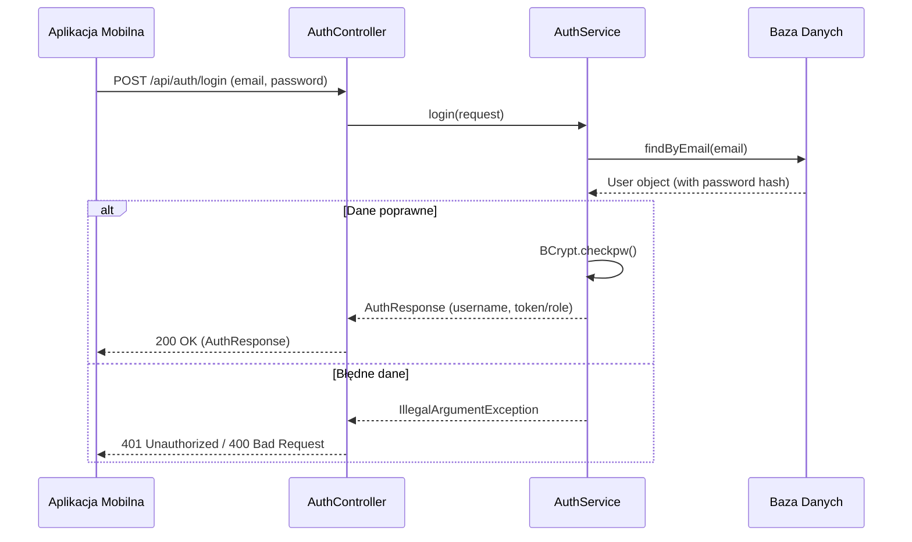
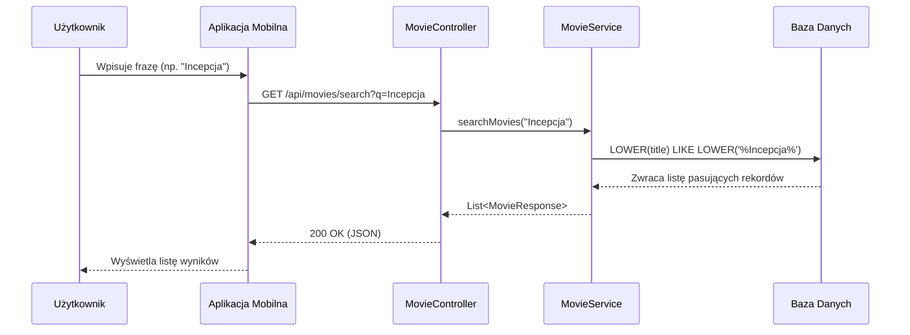
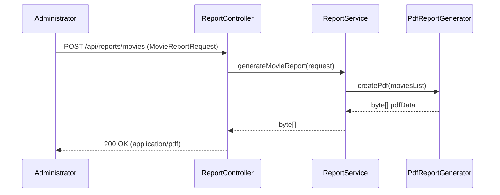
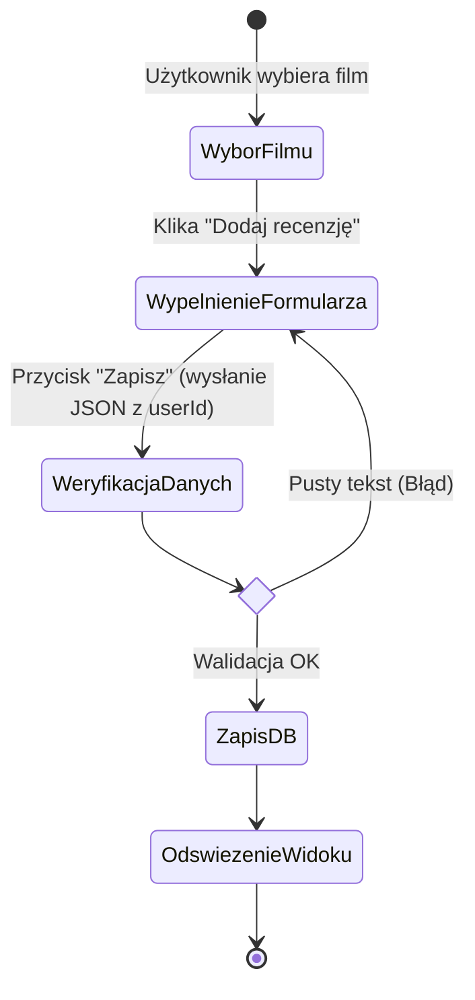
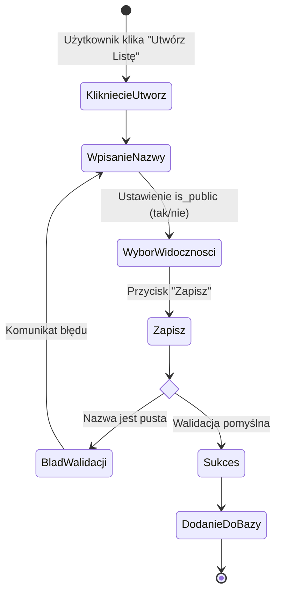
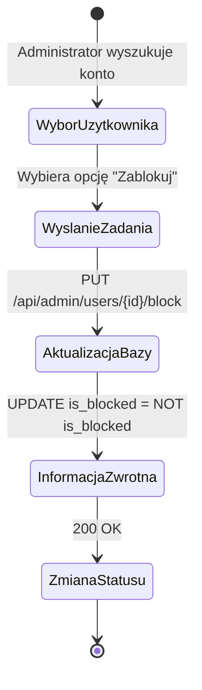

# MovieRate - PZ-26-FIOLETOWI

Aplikacja "MovieRate" pozwala użytkownikom na przeglądanie filmów, ocenianie, pisanie recenzji oraz tworzenie własnych list. Projekt składa się z backendu stworzonego w technologii Spring Boot oraz aplikacji mobilnej na system Android.

## Technologie
* **Backend:** Java 21, Spring Boot (Web, Data JPA, Validation), PostgreSQL, JDBC
* **Frontend:** Android (Kotlin)
* **Infrastruktura:** Docker, Docker Compose

## Uruchomienie projektu (Docker)

Szybki start środowiska przy wykorzystaniu narzędzia Docker Compose:

1. Upewnij się, że masz zainstalowany Docker i Docker Compose.
2. Przejdź do katalogu `MovieRate`.
3. Uruchom polecenie:
   ```bash
   docker-compose up --build -d
   ```
4. Aplikacja backendowa będzie dostępna pod portem `8080`, a baza PostgreSQL pod `5432`.

---

## Architektura i Diagramy UML

Poniżej znajdują się kluczowe diagramy opisujące przepływy oraz strukturę logiki projektu.

### 1. Diagram Przypadków Użycia (Use Case)


### 2. Diagramy Sekwencji

#### 2.1. Logowanie i Autoryzacja



#### 2.2. Wyszukiwanie Filmów



#### 2.3. Generowanie Raportu PDF



### 3. Diagramy Aktywności

#### 3.1. Dodawanie Recenzji



#### 3.2. Tworzenie własnej listy filmów



#### 3.3. Blokowanie Użytkownika


